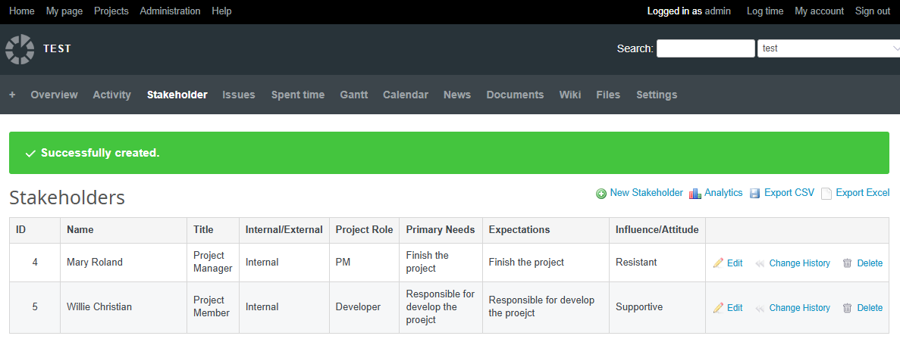
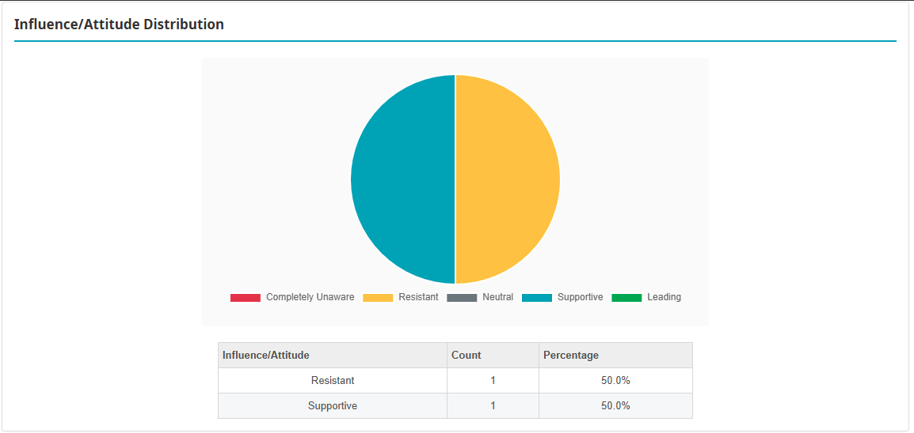

## Redmine 利害關係人插件

一個全面的 Redmine 插件，用於管理和分析專案利害關係人，提供先進的視覺化和匯出功能。

### 功能

#### 核心功能
- **完整的 CRUD 操作**：為每個專案新增、編輯和刪除利害關係人記錄
- **內聯編輯**：直接在列表視圖中編輯利害關係人資料，滑鼠懸停時顯示鉛筆圖示
- **變更歷史記錄**：完整記錄所有利害關係人修改的審計追蹤（新增、修改、刪除）
- **全面的利害關係人追蹤**：
  - 利害關係人姓名
  - 職稱
  - 內部/外部位置類型
  - 專案角色
  - 主要需求
  - 期望
  - 影響/態度程度（完全不覺 / 抵制 / 中立 / 支持 / 領導）

#### 資料匯出
- **CSV 匯出**：將所有利害關係人資料匯出為 CSV 格式，使用 UTF-8 編碼
- **Excel 匯出**：匯出為 .xls 格式（SpreadsheetML），含格式化標題和樣式

#### 變更歷史
- **審計追蹤**：完整記錄所有利害關係人變更
- **用戶追蹤**：追蹤誰進行了每項變更，以及何時變更
- **欄位變更詳情**：查看每項修改的舊值和新值
- **語言支援**：歷史記錄中的欄位值根據當前系統語言正確顯示

#### 設計與國際化
- 適用於所有設備的完全響應式網頁設計
- 完整的雙語支援（繁體中文 / 英文）
- 作為專案頁面中的專用標籤集成
- 基於權限的訪問控制（查看利害關係人 / 管理利害關係人）

### 系統畫面

#### 利害關係人列表


#### 變更歷史記錄


### 安裝

1. 將此插件複製到您的 Redmine `plugins` 目錄：
   ```bash
   cd /path/to/redmine/plugins
   git clone [repository-url] redmine_stakeholder
   ```

2. 執行插件遷移：
   ```bash
   bundle exec rake redmine:plugins:migrate NAME=redmine_stakeholder RAILS_ENV=production
   ```

3. 重新啟動 Redmine

4. 在您的專案設定中啟用「利害關係人」模組

### 使用方式

#### 基本操作
1. 前往您的專案頁面
2. 點擊「利害關係人登錄表」標籤
3. 使用「新增利害關係人」按鈕新增利害關係人
4. 編輯利害關係人的方式有：
   - 點擊「編輯」按鈕以使用完整編輯表單
   - 或者滑鼠懸停在欄位上，點擊鉛筆圖示進行內聯編輯
5. 使用「刪除」按鈕刪除利害關係人

#### 匯出資料
- 點擊「匯出 CSV」以 CSV 格式下載利害關係人資料
- 點擊「匯出 Excel」以 Excel 格式（.xls）下載利害關係人資料

#### 查看變更歷史
1. 在利害關係人列表或詳情頁面點擊「查看歷史」按鈕
2. 查看對利害關係人所做的所有變更，包括：
   - 變更的日期和時間
   - 進行變更的用戶
   - 變更類型（新增 / 修改 / 刪除）
   - 被變更的欄位
   - 舊值和新值

### 權限
有兩個權限級別可用：
- **查看利害關係人**：可以查看利害關係人列表和變更歷史
- **管理利害關係人**：可以新增、編輯、刪除利害關係人，以及查看歷史

### 技術詳情

#### 資料庫架構
插件建立兩個表：

**stakeholders 表**：
- `project_id` (integer)：對專案的參考
- `name` (string)：利害關係人姓名
- `title` (string)：利害關係人職稱
- `location_type` (string)：內部或外部
- `project_role` (string)：在專案中的角色
- `primary_needs` (text)：利害關係人主要需求
- `expectations` (text)：利害關係人期望
- `influence_attitude` (string)：影響/態度程度
- `position` (integer)：顯示順序

**stakeholder_histories 表**：
- `stakeholder_id` (integer)：對利害關係人的參考
- `user_id` (integer)：對進行變更的用戶的參考
- `action` (string)：操作類型（create/update/delete）
- `field_name` (string)：被變更的欄位
- `old_value` (text)：舊值
- `new_value` (text)：新值
- `created_at` (datetime)：變更的時間戳記

#### 使用的技術
- **後端**：Ruby on Rails、ActiveRecord
- **前端**：JavaScript
- **樣式**：使用 flexbox 和 grid 佈局的響應式 CSS
- **匯出格式**：CSV（Ruby CSV 庫）、用於 Excel 的 SpreadsheetML XML
- **AJAX**：用於內聯編輯功能

#### 檔案結構
```
redmine_stakeholder/
├── app/
│   ├── controllers/
│   │   └── stakeholders_controller.rb
│   ├── models/
│   │   ├── stakeholder.rb
│   │   └── stakeholder_history.rb
│   └── views/
│       └── stakeholders/
│           ├── index.html.erb
│           ├── new.html.erb
│           ├── edit.html.erb
│           ├── show.html.erb
│           ├── _form.html.erb
│           └── history.html.erb
├── assets/
│   ├── javascripts/
│   │   └── inline_edit.js
│   └── stylesheets/
│       └── stakeholders.css
├── config/
│   ├── locales/
│   │   ├── en.yml
│   │   └── zh-TW.yml
│   └── routes.rb
├── db/
│   └── migrate/
│       ├── 001_create_stakeholders.rb
│       ├── 002_add_fields_to_stakeholders.rb
│       ├── 003_restructure_stakeholder_fields.rb
│       └── 004_create_stakeholder_histories.rb
├── lib/
│   └── redmine_stakeholder/
│       ├── hooks.rb
│       └── patches/
│           └── project_patch.rb
├── init.rb
└── README.md
```

### 解除安裝

```bash
bundle exec rake redmine:plugins:migrate NAME=redmine_stakeholder VERSION=0 RAILS_ENV=production
rm -rf plugins/redmine_stakeholder
```

### 許可證

本插件遵循 MIT 許可證授權。